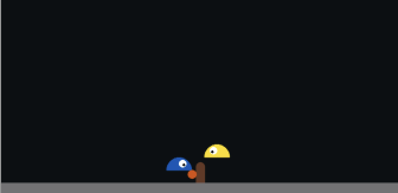

# NEAT slimevolley

Implementation for slimevolley based on neat-python

## How to Run

python ver: 3.9.22

```bash
pip install -r requirements.txt
python main.py <output logs directory name>
```

If you want to eval the final model, run following.

```bash
pip install -r requirements.txt
python eval.py <output logs directory name> <target final model path>
```

## Output

Our final model and result gif are saved to logs/final_model.

### Final Test Gif

The gameplay that our agent wins against the baseline model.


### Final Moment

The moment that our agent wins against the baseline model.


